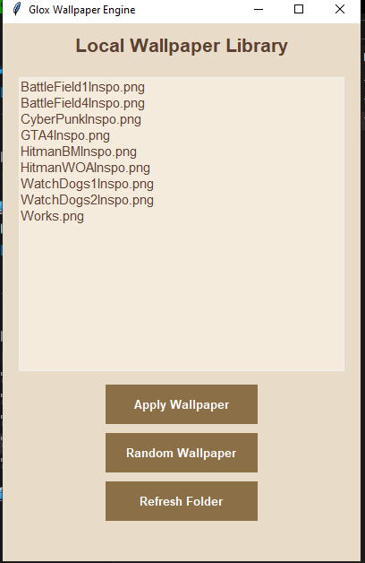

# 🖼️ GloxWallpaper

A lightweight **offline wallpaper engine for Windows** that automatically changes your desktop wallpaper from a curated collection of wallpapers.

Built to provide a simple, fast, and distraction-free wallpaper experience without relying on online services.

---

## ✨ Features

- 🔄 Automatic wallpaper rotation
- 🖼️ Supports multiple wallpaper collections
- ⚡ Lightweight and fast
- 🌐 Completely offline
- 🎮 Gaming-inspired wallpaper collection
- 🤖 AI-generated wallpapers
- 🖥️ Native Windows desktop integration
- 📂 Easy wallpaper management

---

## 📸 Preview

(Add screenshots here)

---

## 🎨 Wallpaper Collections

Current collections include:

- Cyberpunk inspired themes
- Stealth / Agent inspired themes
- Military inspired themes
- Futuristic cities
- Nature landscapes
- Abstract wallpapers

> Wallpapers are AI-generated inspired artwork and are not official game assets.

---

## 🚀 Installation

### Option 1: Download Release

1. Download the latest version from the download page.
2. Extract the ZIP file.
3. Run:

## 🤖 Built with ChatGPT & Codex

GloxWallpaper was developed with the help of **ChatGPT** and **Codex** throughout the development process. ChatGPT assisted with brainstorming features, refining the user interface, debugging issues, improving the project structure, and writing documentation. Codex accelerated development by helping generate and refine Python code, suggest implementation approaches, and resolve technical challenges. Together, they acted as AI development assistants, allowing ideas to move from concept to a polished, open-source desktop application more efficiently.

# ⚠️ Educational & Reference Use Only

> [!WARNING]
> ## Academic Integrity Notice
>
> This repository is published **solely for educational, learning, portfolio, and reference purposes**.
>
> You are welcome to:
> - ✅ Study the source code
> - ✅ Learn from the implementation
> - ✅ Experiment and modify it for personal learning
> - ✅ Build your own projects inspired by this work
>
> **However, you must NOT:**
> - ❌ Submit this repository (or a lightly modified version) as your own assignment or coursework.
> - ❌ Present this project as your own work in any **school, college, university, bootcamp, internship, hackathon, certification, or academic evaluation.**
> - ❌ Claim authorship of this project or any substantial portion of its implementation.
>
> If this project helps you, the expected approach is to **learn from it and create your own original implementation.** Please respect academic integrity and the time invested in developing this project.
